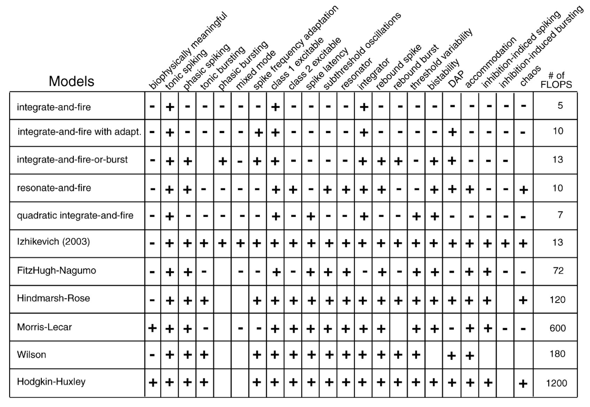
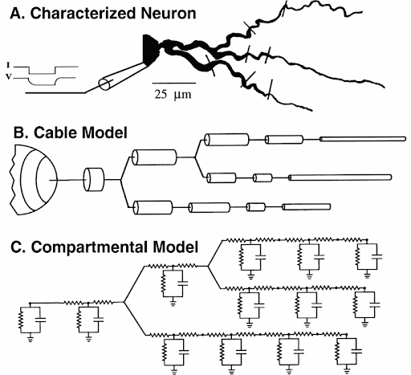
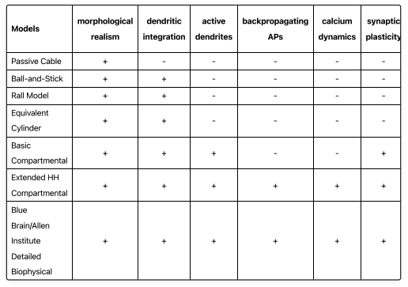

# Neurons

This repository contains various biophysical implementation of neurons, ranging from simple to complex, all built from first principles. The goal is to provide a resource for understanding the progressive complexity of computational neuroscience models.


## Repository Structure

The repository is organized into two main sections:

### 1. Point Neurons
Single-compartment models where the entire neuron is treated as a point in space.



### 2. Multi-Compartment Neurons
Models that divide neurons into multiple compartments to capture spatial complexity.




## Contents

Each Jupyter notebook includes:
- **Description**: Theoretical background of the model
- **Mathematics**: Governing equations and numerical methods
- **Biophysical Relevance**: How the model relates to actual neuronal properties
- **Applications**: Real-world usage in computational neuroscience 
- **Implementation**: Clear, well-commented code
- **Visualization**: Dynamic plots and interactive components


## Setup
To set things up simply install the dependancies using the conda command bellow and run the jupiter notebook

```bash
conda env create -f neurons_environment.yml
conda activate neurons_env
```

Enjoy!
